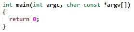

# iVim: Vim inspired color scheme



> A color scheme inspired by Vim's default color scheme.

## Install

Move to the [releases](https://github.com/jan509/iVim/release) page and download the latest release.
Unpack the downloaded TAR/ZIP archive and paste the themes into your Packages folder. Please know that the location
can be different when using different editors/operating systems. Currently the Theme was tested with Sublime Text 3.

## FAQ

#### What is ``iVim (colored comments).tmTheme``?

Vim's default color scheme marks TODOs with a yellow color which looks pretty dang! But instead of doing this for all comments there is a special one (``iVim (colored comments).tmTheme``) which you can also use.

#### Does this Theme works with Textmate?

Normally every theme with the extension ``.tmTheme`` works with Textmate.

#### Which editors are supported?

Currently I only know that this theme works with:
- Sublime Text 2/3
- Textmate

*BTW: Test other editors and tell about it!*

## License

MIT:
```
Copyright (c) 2015 Jan Kowalewicz

Permission is hereby granted, free of charge, to any person obtaining a copy
of this software and associated documentation files (the "Software"), to deal
in the Software without restriction, including without limitation the rights
to use, copy, modify, merge, publish, distribute, sublicense, and/or sell
copies of the Software, and to permit persons to whom the Software is
furnished to do so, subject to the following conditions:

The above copyright notice and this permission notice shall be included in all
copies or substantial portions of the Software.

THE SOFTWARE IS PROVIDED "AS IS", WITHOUT WARRANTY OF ANY KIND, EXPRESS OR
IMPLIED, INCLUDING BUT NOT LIMITED TO THE WARRANTIES OF MERCHANTABILITY,
FITNESS FOR A PARTICULAR PURPOSE AND NONINFRINGEMENT. IN NO EVENT SHALL THE
AUTHORS OR COPYRIGHT HOLDERS BE LIABLE FOR ANY CLAIM, DAMAGES OR OTHER
LIABILITY, WHETHER IN AN ACTION OF CONTRACT, TORT OR OTHERWISE, ARISING FROM,
OUT OF OR IN CONNECTION WITH THE SOFTWARE OR THE USE OR OTHER DEALINGS IN THE
SOFTWARE.
```